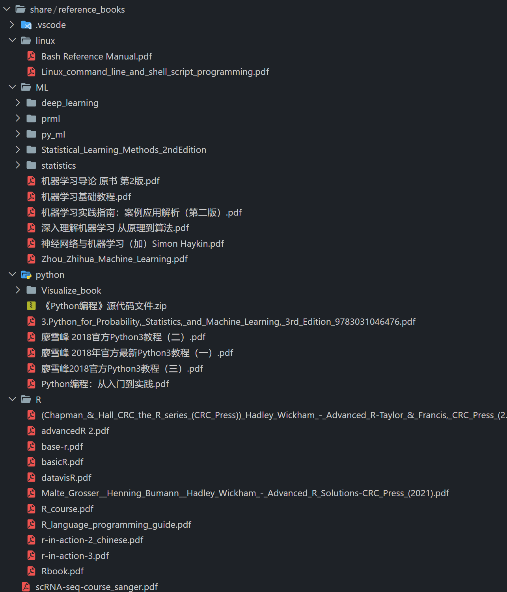

# How to learn R

* **[数据科学中的 R 语言](https://bookdown.org/wangminjie/R4DS/)**
  四川师范大学研究生公选课《数据科学中的R语言》的课程内容. R for Data Science 中文版.
* **[R for Data Science](https://r4ds.had.co.nz/)** # 推荐入门
  Hadley Wickham的 r4ds这本书 **(**[Grolemund and Wickham 2017](https://bookdown.org/wangminjie/R4DS/references.html#ref-Wickham2017))。作者 2019年8月 获得考普斯总统奖（被誉为统计学的诺贝尔奖）
* **[Advanced R](https://adv-r.hadley.nz/) / [Solutions](http://advanced-r-solutions.rbind.io/)**  # if you want to be an R developer
  Advanced R is designed primarily for R users who want to improve their programming skills and understanding of the language
  Solutions: By Malte Grosser and Henning Bumann, provides worked solutions to the exercises in this book.
* [Home | Bookdown](https://bookdown.org/)
  Everything about R.

# How to learn python

* [Python-100-Days](https://github.com/jackfrued/Python-100-Days)
* [数学语言辞典，MATLAB/Python/NumPy/R中的同义命令](https://mathesaurus.sourceforge.net/)

# How to learn statstics

# How to learn maching learning

1. 入门

   1. 吴恩达机器学习： [吴恩达机器学习系列课程_哔哩哔哩_bilibili](https://www.bilibili.com/video/BV164411b7dx?spm_id_from=333.999.0.0)
   2. 吴恩达深度学习： [吴恩达深度学习deeplearning.ai_哔哩哔哩_bilibili](https://www.bilibili.com/video/BV1FT4y1E74V?spm_id_from=333.999.0.0&vd_source=4c0518a6bef83f692def7c8a7b84e9ad)
      吴恩达课程更新部分：**23/5/18* 更新
      [吴恩达2022机器学习 machine learning specialization](https://www.bilibili.com/video/BV19B4y1W76i/?spm_id_from=333.337.search-card.all.click&vd_source=fd14c8a48e98e913fe83864fa660e5ce)
      [(强推|双字)2021版吴恩达深度学习课程Deeplearning.ai](https://www.bilibili.com/video/BV12E411a7Xn/?vd_source=fd14c8a48e98e913fe83864fa660e5ce)
   3. [李宏毅ML+DL： (强推)李宏毅2021/2022春机器学习课程_哔哩哔哩_bilibili](https://www.bilibili.com/video/BV1Wv411h7kN?spm_id_from=333.999.0.0&vd_source=4c0518a6bef83f692def7c8a7b84e9ad)
      备注：吴恩达课程相对宽泛、适合基础入门，李宏毅课程更加详细。建议顺序：1）-> 2) -> 3)。吴恩达课程对应练习题可在百度、必应、GitHub上自行搜索。
      **Coursera官网的吴恩达课程一定是最新版的,且附带代码练习，强烈推荐，不过需要收费**
      [ML.Coursera](https://www.coursera.org/specializations/machine-learning-introduction)
      [DL.Coursera](https://www.coursera.org/specializations/deep-learning)
2. 深度学习经典图书：《深度学习_[美]Ian Goodfellow》
3. 深度学习常用框架: Tensorflow、keras、pytorch、MXNet、Caffe等，建议先选择一种框架学习、熟练使用。以下三个教程均是基于python实现，可以简单理解这些框架类似于python的第三方package。
   Pytorch：视频
   [PyTorch深度学习快速入门教程（绝对通俗易懂！）【小土堆】_哔哩哔哩_bilibili](https://www.bilibili.com/video/BV1hE411t7RN?spm_id_from=333.1007.top_right_bar_window_custom_collection.content.click&vd_source=4c0518a6bef83f692def7c8a7b84e9ad)
   [Tensorflow]：书《Tensorflow深度学习》
   Keras：书《python 深度学习》
   备注：建议先跟着教程中的代码进行学习，熟悉后，随便找感兴趣的文献模型进行复现。另，Tensorflow 2中已经引入了Keras，因此如果安装了Tensorflow 2，就不需要再装Keras，可以直接使用命令（ import tensorflow.keras ）。
4. 人工智能拓展学习视频：
   [王树森老师：ShusenWang的个人空间_哔哩哔哩_bilibili](https://space.bilibili.com/1369507485/video?tid=0&page=1&keyword=&order=pubdate)
   [李沐老师：跟李沐学AI的个人空间_哔哩哔哩_bilibili](https://space.bilibili.com/1567748478/video)

- other resources
  [lovingers/ML_Books: 宗旨：构建全球最大的ML相关的学习书籍平台（吹牛的） (github.com)](https://github.com/lovingers/ML_Books)
  [3Blue1Brown(数学原理可视化)](https://www.3blue1brown.com/#lessons)
  [Immersive Math(线代运算可视化)](http://immersivemath.com/ila/index.html)

  [microsoft/ML-For-Beginners: 12 weeks, 26 lessons, 52 quizzes, classic Machine Learning for all (github.com)](https://github.com/microsoft/ML-For-Beginners) # 微软5万star的教程，没看过
- [南京大学周志华教授亲讲机器学习](https://www.bilibili.com/video/BV1R44y1o749/?spm_id_from=333.337.search-card.all.click) # 非常基础

# How to learn omics

# How to learn single cell RNAseq

- [Scanpy – Single-Cell Analysis in Python](https://scanpy.readthedocs.io/en/stable/index.html)
- [sc-best-practices / for python users](https://www.sc-best-practices.org/) # Further development of scanpy
- [Seurat official](https://satijalab.org/seurat/)
- [Sanger institute](https://www.singlecellcourse.org/)
- [Harvard hbc](https://github.com/hbctraining) # including scRNA-seq, R, shell, rna-seq. Recommended for beginners.
- [A great book on exclusively the Bioconductor ecosystem](https://bioconductor.org/books/release/OSCA/) # not recommended. SCE is not well developed as Seurat
- [NBIS / a distributed national bioinformatics infrastructure, supporting life sciences in Sweden.](https://nbisweden.github.io/workshop-scRNAseq/exercises.html) # including scRNA-seq, R, shell, rna-seq. Recommended for beginners but may not as good as Harvard.
- [Single Cell Multi-Omics Data Analysis](https://bookdown.org/ytliu13207/SingleCellMultiOmicsDataAnalysis/) # I've never seen it, but maybe we could learn from it.
- [gao-lab/Guideline-for-Computational-Biology-and-Bioinformatics](https://github.com/gao-lab/Guideline-for-Computational-Biology-and-Bioinformatics) #
- https://statbiomed.github.io/HKU-single-cell-workshop/  #2021 HongKong university
- 
- youtube
  [https://www.youtube.com/@sanbomics](https://www.youtube.com/@sanbomics)

# resources

These books and resources are shared in luoliheng@10.168.203.60.
You can copy it directly or synchronize(同步) this file by sftp.
*Some files may be out of date, feel free to add, delete and update.*
Directory: `/public/home/luoliheng/share/reference_books`

