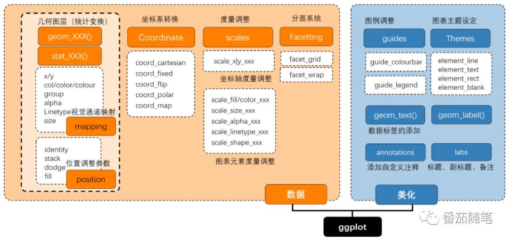

# ggplot2语法框架

有明确的起始（ggplot()开始）与终止，图层之间的叠加是靠**“+”**实现的，越往后，其图层越在上方。
通常一条geom_XXX()函数或stat_XXX()函数可以绘制一个图层。而且扩展包丰富，有专门调整颜色、字体和主题等辅助包。
语法框架如图1，主要分为数据绘图（数据+几何形状）和美化两部分
 


# aes

指定变量用于作图，aes代表美学。ggplot2将图的X轴和Y轴以及颜色、大小、形状、填充等也视为美学。如果你想要固定颜色，大小等(即不基于数据帧中的变量而变化)，你需要在' aes() '之外指定它

ggplot(diamonds, aes(x=carat, y=price, color=cut)) + geom_point() + geom_smooth()
和以下代码等同
ggplot(diamonds) + geom_point(aes(x=carat, y=price, color=cut)) + geom_smooth(aes(x=carat, y=price, color=cut))

ggplot(diamonds, aes(x=carat, y=price, color=cut, shape=color)) + geom_point()
形状和颜色等同
x,y指定坐标，其它参数都用于指定对应分类的绘制特点，在分类变量未指定的时候，参数可使用另一组已指定分类的参数

## x/y

有3种方法可以改变X轴和Y轴的限制。  

1. 使用coord_cartesian (xlim = c (x1, x2))  
2. 使用xlim (c (x1, x2))  
3.使用scale_x_continuous(limits= c (x1, x2))  
**警告:**第2项和第3项将从数据本身删除超出限制的数据点。所以，如果你添加任何平滑的线，结果将是扭曲的。第1项(coord_cartesian)不删除任何数据点，而是放大到图表的特定区域。

* 'alpha'  
* 'colour'  
* 'fill'  
* 'group'  
* 'linetype'  
* 'linewidth'  
* 'weight'  
* 'ymax'  
* 'ymin'

# scale

改变X轴和Y轴的文本及其位置涉及到两个方面:“breaks”和“labels”。
breaks=seq(0, 0.1, 0.01), labels = letters[1:11]
![[Pasted image 20230310204612.png]]

scale_x_continuous()
scale_y_continuous()'
有三种变体  为常用的转换设置'trans'参数:
`scale_**log10(), scale***sqrt() and scale**_reverse().

## scale_x_continuous

**name = waiver()**
刻度的名称。用作图例标题或轴。如果'waiver()'为默认值，则比例的名称取自用于该美学的第一个映射。如果'NULL'，图例标题将被省略。
**breaks = waiver(),**  
* 'NULL'表示没有breaks
* 'waiver()'用于转换对象计算的默认断点
* 位置的数字向量
* 将极限作为输入并返回断点作为输出的函数(例如，由'scales::extended_breaks()'返回的函数)。也接受rlang lambda函数符号。
**minor_breaks = waiver(),**  
**n.breaks = NULL,**  
一个整数，用来指示主要breaks次数。算法可能会选择一个稍微不同的数字，以确保良好的间断标签。只有在'breaks = waiver()'时才会生效。使用'NULL'来使用转换给出的默认中断数。
**labels = waiver(),**  
* “NULL”表示没有标签

* 'waiver()'用于转换对象计算的默认标签

- 给出标签的字符向量(长度必须与'breaks'相同)
* 表达式向量(必须与断点长度相同)。plotmath
* 一个函数，它将断点作为输入，并将标签作为输出返回。也接受rlang lambda函数符号。
**limits = NULL,**  
**expand = waiver(),**  
对于位置标尺，一个范围扩展常数的向量，用于在数据周围添加一些填充，以确保它们被放置在距离轴一定距离的地方。使用方便函数'expansion()'来生成'expand'参数的值。对于连续变量，默认值是每边扩大5%，对于离散变量，默认值是每边扩大0.6个单位。
**oob = censor,**  
**na.value = NA_real_,**  
缺失的值将被替换为该值
**trans = "identity",**  
对于连续尺度，转换对象或对象本身的名称。内置转换含 "asn"、"atanh"、"boxcox"、"date"、"exp"、"hms"、"identity"、"log"、"log10"、"log1p"、"log2"、"logit"、"modulus"、"probability"、"probit"、"pseudo_log"、"reciprocal"、"reverse"、"sqrt"和"time"
`转换对象将转换、它的逆函数以及用于生成断点和标签的方法捆绑在一起。转换对象定义在scales包中，并被称为<name>_trans(例如，'scales::boxcox_trans()')。您可以使用'scales::trans_new()'创建自己的转换。
**guide = waiver(),**  
用于创建指南或其名称的函数。有关更多信息，请参阅“guides()”。
**position = "left"**
对于位置标尺，表示轴的位置。y轴为“左”或“右”，x轴为“上”或“下”。
**sec.axis = waiver()**  
用于指定次要轴。

## scale_colour_gradient

`Scale_ *_gradient创建一个双色梯度(low-high)， Scale_ *_gradient2创建一个发散的颜色梯度(low- middle -high)， Scale_ *_gradientn创建一个n色梯度。有关这些刻度的分类变体，请参阅颜色步骤。`

scale_colour_gradient(  
...,  fill
low = "#132B43",  
high = "#56B1F7",  
space = "Lab",  
na.value = "grey50",  
guide = "colourbar",  
aesthetics = "colour"  fill
)  

scale_colour_gradient2(  
...,  fill
low = muted("red"),  
mid = "white",  
high = muted("blue"),  
midpoint = 0,  
space = "Lab",  
na.value = "grey50",  
guide = "colourbar",  
aesthetics = "colour"  fill
)  

scale_colour_gradientn(  
...,  fill
colours,  
values = NULL,  
space = "Lab",  
na.value = "grey50",  
guide = "colourbar",  
aesthetics = "colour",  fill
colors  
)  

Arguments:
...: Arguments passed on to 'continuous_scale'  
**'scale_name'**
用于与此刻度相关的错误消息的刻度名。
**'palette'**
一个调色板函数，当使用值在0到1之间的数值向量调用时，返回相应的输出值(例如，'scales::area_pal()')。
**'name'**
刻度的名称。用作图例标题或轴。如果'waiver()'为默认值，则比例的名称取自用于该美学的第一个映射。  
如果'NULL'，图例标题将被省略。
**'breaks'**
**'minor_breaks**
**'n.breaks'**
**'labels'**
**'limits'**
**'oob'**
**'expand'**
对于位置标尺，一种范围扩展常数向量，用于在数据周围添加一些填充，以确保它们被放置在距离轴一定距离的地方。使用方便函数“expansion()”来为'expand'参数生成值。对于连续变量，默认值是每边扩大5%，对于离散变量，默认值是每边扩大0.6个单位。
**'position'**
'**super**'
用于构造的标度的超类
**low, high:**
渐变的低端和高端颜色。
**space:**
用于计算梯度的颜色空间。必须为“Lab”-其他值不建议使用。
**na.value:**
**guide:**
图例类型。使用'"colourbar"'表示连续色条，使用'"legend"'表示离散色条。

**aesthetics:**
字符串或字符串向量，列出此标度所使用的美学名称。这可能很有用，例如，通过'aesthetics = c(" color "， "fill")'同时应用颜色设置到' color '和'fill'美学。
**mid:**
中点颜色
**midpoint:**
发散尺度的中点(数据值)。默认值为0。
**colours, colors:**
颜色矢量用于n色梯度。
**values**:
如果颜色不应该沿着梯度均匀定位，这个矢量会给出“colors”矢量中每个颜色的位置(在0到1之间)。有关将任意范围映射到0到1之间的方便函数，请参阅'rescale()'。

# 统计

**mapping**
**x,y**
**col**
**group**
**alpha**
**linetype**
**size**
**position**
**identity**
**stack**
**dodge**
**fill**

**在点周围添加文本和标签**
geom_text(aes(label=large_county), size=2, data=midwest_sub) +
geom_label(aes(label=large_county), size=2, data=midwest_sub, alpha=0.25)
**library(ggrepel)**
geom_text_repel
geom_label_repel

**添加注释**
可以用' annotation_custom() '函数来完成，该函数接受一个' grob '作为参数。
my_text <- "This text is at x=0.7 and y=0.8!"
my_grob = grid.text(my_text, x=0.7,  y=0.8, gp=gpar(col="firebrick", fontsize=14, fontface="bold"))
gg + annotation_custom(my_grob)

## geom

### geom_text

文本宝石对于标记图很有用。它们可以单独用作散点图，也可以与其他几何体结合使用，例如，用于标记点或注释条的高度。'geom_text()'只向图形中添加文本。'geom_label()'在文本后面画一个矩形，使其更容易阅读。

Usage:

geom_label(  
mapping = NULL,  
data = NULL,  
stat = "identity",  
position = "identity",  
...,  
parse = FALSE,  
nudge_x = 0,  
nudge_y = 0,  
label.padding = unit(0.25, "lines"),  
label.r = unit(0.15, "lines"),  
label.size = 0.25,  
na.rm = FALSE,  
show.legend = NA,  
inherit.aes = TRUE  
)  
  
geom_text(  
mapping = NULL,  
data = NULL,  
stat = "identity",  
position = "identity",  
...,  
parse = FALSE,  
nudge_x = 0,  
nudge_y = 0,  
check_overlap = FALSE,  
na.rm = FALSE,  
show.legend = NA,  
inherit.aes = TRUE  
)  

Arguments:

**mapping:**
由'aes()'创建的美学映射集。如果指定和` inherit。aes = TRUE'(默认值)，它与绘图顶层的默认映射相结合。如果没有情节映射，你必须提供“映射”。
**data:**
要在此层中显示的数据。
'NULL'，则数据继承自绘图调用'ggplot()'中指定的数据。
'data.frame'或其他对象将覆盖绘图数据。所有对象都将被强化以产生一个数据帧。请参阅'fortify()'了解将创建哪些变量。
“函数”将被调用一个单独的参数，绘图数据。返回值必须是'data.frame'，并将用作层数据。一个“函数”可以从一个“公式”
**stat:**
在这一层的数据上使用的统计转换，无论是作为一个'ggproto' 'Geom'的子类，还是作为一个字符串命名的统计剥离了'stat_'前缀(例如。“count”而不是“stat_count”)
**position:**
位置调整，可以是字符串形式，也可以是调用位置调整函数的结果。不能与'nudge_x'或'nudge_y'连接指定。
**...:**
其他的arguments转移到了layer()”。这些通常是aes，用于将美学设置为固定值，如“color =“red”或“size = 3”。它们也可以是参数成对的geom/stat。
**parse:**
如果是'TRUE'，则标签将被解析为表达式并按'?plotmath'中描述的方式显示。
**nudge_x, nudge_y:**
水平和垂直调整轻推标签通过。用于从点偏移文本，特别是在离散尺度上。不能与'position'共同指定。
**label.padding:**
标签周围的填充量。默认为0.25行。
**label.r:**
圆角的半径。默认为0.15行。
**label.size:**
标签边框大小，单位:毫米。
**na.rm:**
如果'FALSE'，默认的，缺失的值将被删除，并发出警告。如果'TRUE'，缺失的值将被无声地删除。
**show.legend:**
逻辑。这个图层应该包含在图例中吗?'NA'，默认值，包括是否映射任何美学。'FALSE'从不包含，'TRUE'总是包含。它也可以是一个指定的逻辑向量，以精细地选择要显示的美学。
**inherit.aes:**
如果'FALSE'，将覆盖默认的美学，而不是与它们组合。这对于既定义了数据又定义了外观并且不应该从默认的绘图规范中继承行为的helper函数是最有用的。“边界()”。
**check_overlap:**
如果'TRUE'，在同一层中与先前文本重叠的文本将不会被绘制。'check_overlap'发生在绘制时，并按照数据的顺序。因此，在调用'geom_text()'之前，数据应该按标签列排列。注意，'geom_label()'不支持该参数

### geom_point

### geom_bar

plot1 <- ggplot(mtcars, aes(x=cyl)) + geom_bar() + labs(title=“频率柱状图”)# Y轴来源于x项的计数
df <-data.frame (var = c(“a”、“b”、“c”),num = c (1:3))
plot2<-ggplot(df, aes(x=var, y=nums)) + geom_bar(stat = "identity") # y轴显示identity

### geom_smooth

平滑的线

### aes_string

### geom_density

密度图

### geom_vline

这些宝石将参考线(有时称为规则)添加到绘图中，可以是水平的、垂直的或对角线(由斜率和截距指定)。这些对于注释图很有用。

Usage:

geom_abline(  
mapping = NULL,  
data = NULL,  
...,  
slope,  
intercept,  
na.rm = FALSE,  
show.legend = NA  
)  
  
geom_hline(  
mapping = NULL,  
data = NULL,  
...,  
yintercept,  
na.rm = FALSE,  
show.legend = NA  
)  
  
geom_vline(  
mapping = NULL,  
data = NULL,  
...,  
xintercept,  
na.rm = FALSE,  
show.legend = NA  
)  

Arguments:
**mapping:**
**data**:
**...:**
**na.rm:**
**show.legend:**
**xintercept, yintercept, slope, intercept:**
控制线条位置的参数。 If these are set, 'data', 'mapping' and 'show.legend' are overridden.
Details:
这些宝石的行为与其他宝石略有不同。可以通过两种方式提供参数:作为层函数的参数，或者通过美学。如果你使用论点，例如:'geom_abline(intercept = 0, slope = 1)'，然后在幕后，geom生成一个新的数据帧，其中只包含您提供的数据。这意味着这些线在所有方面都是一样的;如果您希望它们在各个方面不同，可以自己构造数据框架并使用美学。
与大多数其他宝石不同的是，这些宝石不会从情节默认中继承美学，因为它们不理解通常在情节中设置的x和y美学。它们也不影响x和y尺度。

## stat

### _count

柱状图有两种类型:geom_bar()和geom_col()。
Geom_bar()使条的高度与每组中的case数量成比例(如果提供了权重美学，则为权重的总和)。
如果希望条形图的高度表示数据中的值，请使用geom_col()。
Geom_bar()默认使用stat_count():它计算每个x位置的情况数。
Geom_col()使用stat_identity():它保持数据不变。
###_smooth

线性回归(method=lm)
帮助眼睛在过度绘图的情况下看到模式。'geom_smooth()'和'stat_smooth()'实际上是别名:它们都使用相同的参数。如果您想使用非标准的geom显示结果，请使用'stat_smooth()'。

geom_smooth(  
mapping = NULL,  
data = NULL,  
stat = "smooth",  
position = "identity",  
...,  
method = NULL,  
formula = NULL,  
se = TRUE,  
na.rm = FALSE,  
orientation = NA,  
show.legend = NA,  
inherit.aes = TRUE  
)  
  
stat_smooth(  
mapping = NULL,  
data = NULL,  
geom = "smooth",  
position = "identity",  
...,  
method = NULL,  
formula = NULL,  
se = TRUE,  
n = 80,  
span = 0.75,  
fullrange = FALSE,  
level = 0.95,  
method.args = list(),  
na.rm = FALSE,  
orientation = NA,  
show.legend = NA,  
inherit.aes = TRUE  
)  

Arguments:

**mapping:**
由'aes()'创建的美学映射集。如果指定和` inherit。aes = TRUE'(默认值)，它与绘图顶层的默认映射相结合。如果没有情节映射，你必须提供“映射”。
**data:**
**position:**
位置调整，以字符串的形式命名调整(例如:'"jitter"'使用'position_jitter')，或者调用位置调整函数的结果。如果您需要更改调整的设置，请使用后者。
**...:**
**method:**
平滑方法(函数)使用，接受'NULL'或字符向量，例如。“lm”,“glm”,“gam”,“loess”。'"auto"'也可用于向后兼容。它等价于'NULL'。
对于'method = NULL'，平滑方法是根据最大组的大小选择的(在所有面板上)。
**formula:**
用于平滑函数的公式，如。'y ~ x' 'y ~ poly(x, 2)' 'y ~ log(x)'默认为'NULL'，在这种情况下，'method = NULL'意味着'公式= y ~ x'当观测值少于1000个时，'公式= y ~ s(x, bs = "cs")'否则。
**se**:
显示置信区间左右平稳?(默认为'TRUE'，请参见'level'来控制。)
**na.rm:**
如果'FALSE'，默认的，缺失的值将被删除，并发出警告。如果'TRUE'，缺失的值将被无声地删除。
**orientation:**
图层的方向。默认值('NA')自动从美学映射中确定方向。在极少数失败的情况下，可以通过将“orientation”设置为“x”或“y”来显式给出。更多细节请参见_Orientation_部分。
**show.legend:**
**inherit.aes:**
**geom, stat:**
用于覆盖'geom_smooth()'和'stat_smooth()'之间的默认连接。
**n:**
平滑求值的点数。
**span:**
控制默认黄土平滑器的平滑量。较小的数字产生摆动的线条，较大的数字产生平滑的线条。仅用于黄土，即当'method = "黄土"'，或'method = NULL'(默认值)，且观测值少于1000个时。
loess
**fullrange:**
如果'TRUE'，平滑线将扩展到图的范围，可能超出数据。这不会将该行扩展为'expansion'创建的任何额外填充。
**level:**
要使用的置信区间级别(默认为0.95)。
**method.args:**
传递给'method'定义的建模函数的附加参数列表。
**Orientation:**
这个geom对待每个轴都不同，因此可以有两个方向。通常，方向很容易从给定映射和所使用的位置尺度类型的组合中推导出来。因此，默认情况下，ggplot2将尝试猜测该层应该具有哪个方向。在极少数情况下，方向是模糊的，猜测可能会失败。在这种情况下，方向可以直接使用“orientation”参数指定，该参数可以是“x”或“y”。该值给出了geom应该沿着的轴，“x”是默认的方向
Aesthetics:
'geom_smooth()' understands the following aesthetics

* *'x'*  
* *'y'*  
* 'alpha'  
* 'colour'  
* 'fill'  
* 'group'  
* 'linetype'  
* 'linewidth'  
* 'weight'  
* 'ymax'  
* 'ymin'

### 其它

静态注释
annotation_custom(my_grob)

# 坐标 coord

**_cartesian**

coord_cartesian(xlim = NULL, ylim = NULL, expand = TRUE, default = FALSE, clip = "on")
参数:xlim, ylim: x轴和y轴的限制。
expand:如果默认为'TRUE'，则在限制中添加一个小的扩展因子，以确保数据和轴不重叠。如果'FALSE'，则从数据或'xlim'/'ylim'中取限制。
default:这是默认的坐标系统吗?如果'FALSE'(默认值)，那么用另一个坐标系统替换这个坐标系统会创建一个消息，提醒用户这个坐标系统正在被替换。如果'TRUE'，该警告被抑制。
clip:图纸是否应该剪到图面板的程度?设置为“on”(默认值)表示是，设置为“off”表示否。在大多数情况下，不应更改默认的“on”，因为设置“clip =”off”可能会导致意想不到的结果。它允许在图的任何地方绘制数据点，包括在图的边缘。

**_flip**
水平与垂直
**_equal**
xy轴相等

# 度量 scale

name
 图例标题

## _color

_discrete
默认的离散色阶。默认为'scale_fill_hue()'/'scale_fill_brewer()'，除非'type'(默认为'ggplot2.discrete.fill'/'ggplot2.discrete. fill')。color ' options)被指定。

_brewer
来自ColorBrewer的“brewer”刻度提供连续的、发散的和定性的配色方案。它们特别适合在地图上显示离散值。参见<https://colorbrewer2.org>了解更多信息。

Usage:

scale_colour_brewer(  
...,  
type = "seq",  
palette = 1,  
direction = 1,  
aesthetics = "colour"  
)  
  
scale_fill_brewer(  
...,  
type = "seq",  
palette = 1,  
direction = 1,  
aesthetics = "fill"  
)  
  
scale_colour_distiller(  
...,  
type = "seq",  
palette = 1,  
direction = -1,  
values = NULL,  
space = "Lab",  
na.value = "grey50",  
guide = "colourbar",  
aesthetics = "colour"  
)  
  
scale_fill_distiller(  
...,  
type = "seq",  
palette = 1,  
direction = -1,  
values = NULL,  
space = "Lab",  
na.value = "grey50",  
guide = "colourbar",  
aesthetics = "fill"  
)  
  
scale_colour_fermenter(  
...,  
type = "seq",  
palette = 1,  
direction = -1,  
na.value = "grey50",  
guide = "coloursteps",  
aesthetics = "colour"  
)  
  
scale_fill_fermenter(  
...,  
type = "seq",  
palette = 1,  
direction = -1,  
na.value = "grey50",  
guide = "coloursteps",  
aesthetics = "fill"  
)  

Arguments:

...:
  
type: One of "seq" (sequential), "div" (diverging) or "qual"  (qualitative)

palette: 如果是字符串，将使用那个命名的调色板。如果是数字，将索引到调色板列表的适当“类型”。可用的调色板列表可以在调色板部分中找到。

direction: 设置刻度中颜色的顺序。如果默认值为1，颜色将由'RColorBrewer::brewer.pal()'输出。如果是-1，颜色的顺序颠倒。

aesthetics:字符串或字符串向量，列出此标度所使用的美学名称。这可能很有用，例如，通过'aesthetics = c(" color "， "fill")'同时应用颜色设置到' color '和'fill'美学。

values: 如果颜色不应该沿着梯度均匀定位，这个矢量会给出“colors”矢量中每个颜色的位置(在0到1之间)。有关将任意范围映射到0到1之间的方便函数，请参阅'rescale()'。

space:用于计算梯度的颜色空间。必须为“Lab”-其他值不建议使用。

na.value: Colour to use for missing values

guide:图例类型。使用'"colourbar"'表示连续色条，使用'"legend"'表示离散色条。

Details:

The 'brewer' scales were carefully designed and tested on discrete  data. They were not designed to be extended to continuous data,  but results often look good. Your mileage may vary.

Palettes:

The following palettes are available for use with these scales:  
  
Diverging BrBG, PiYG, PRGn, PuOr, RdBu, RdGy, RdYlBu, RdYlGn,  
Spectral  
  
Qualitative Accent, Dark2, Paired, Pastel1, Pastel2, Set1, Set2,  
Set3  
  
Sequential Blues, BuGn, BuPu, GnBu, Greens, Greys, Oranges, OrRd,  
PuBu, PuBuGn, PuRd, Purples, RdPu, Reds, YlGn, YlGnBu,  
YlOrBr, YlOrRd  
  
Modify the palette through the 'palette' argument.

## _shape

# 分面 facet

## facet_wrap

**facet_wrap(color ~ cut)**  
row: color, column: cut
**nrow, ncol

**scales**
尺度应该是固定的('"fixed"'，默认值)，自由的('"free"')，还是一维的自由的('"free_x"'， '"free_y"')
**shrink**
如果'TRUE'，将缩小规模以适应统计数据的输出，而不是原始数据。如果“FALSE”，将是统计汇总前的原始数据范围。
**labeller**
一个函数，它接受一个标签数据帧并返回字符向量的列表或数据帧。每个输入列对应一个因子。因此，'vars(cyl, am)'将不止一个。每个输出列在条带标签中显示为单独的一行。这个函数应该继承自"labeller" S3类，以兼容'labeller()'。您可以为不同类型的标签使用不同的标记函数，例如使用'label_parsed()'来格式化facet标签。'label_value()'默认使用，检查它以获得更多细节和指向其他选项的指针。

**as.table**
如果默认为'TRUE'，则facet将像表格一样布局，最高值位于右下角。如果为“FALSE”，则facet将像一个图一样布局，最高值位于右上角。

**switch**
默认情况下，标签显示在图的顶部和右侧。如果是'"x"'，则顶部标签将显示到底部。如果是“y”，右边的标签会显示在左边。也可以设置为“both”。

**drop**
如果默认为'TRUE'，则所有未在数据中使用的因子级别将自动删除。如果为“FALSE”，则将显示所有因子水平，无论它们是否出现在数据中。
  
**dir**
 h ' '表示水平，默认值，或者  “v”代表垂直。

**strip.position**
默认情况下，标签显示在图的顶部
可以通过设置将标签放置在四个边的任意一侧
strip.position = c("top", "bottom", "left", "right")'

## facet_grid

'facet_grid()'形成由行和列面形变量定义的面板矩阵。
当你有两个离散变量，并且数据中存在变量的所有组合时，它是最有用的。如果只有一个具有多个级别的变量，请尝试'facet_wrap()'。

中间一行和下面一行的标题占据了很大的空间。' facet_grid() '会去掉它，给图表更多的区域。与' facet_grid '的主要区别是，它不能选择网格中的行数和列数

# 主题 them

**theme_set(theme_classic())**

**改变图背景**
theme(panel.background = element_rect(fill = "khaki"),
panel.grid.major = element_line(colour = "burlywood", size = 1.5),
panel.grid.minor = element_line(colour = "tomato", size = .25, linetype = "dashed"),
panel.border = element_blank(),
axis.line.x = element_line(colour = "darkorange", size = 1.5, lineend = "butt"), axis.line.y = element_line(colour = "darkorange", size = 1.5))
**如何删除主要和次要网格，改变边界，轴标题，文本和刻度**
theme(panel.grid.major = element_blank(),
          panel.grid.minor = element_blank(),
          panel.border = element_blank(),
          axis.title = element_blank(),
          axis.text = element_blank(),
          axis.ticks = element_blank())
**在背景中添加一个图像**
img <- png::readPNG("screenshots/Rlogo.png")  # source: <https://www.r-project.org/>
g_pic <- rasterGrob(img, interpolate=TRUE)

theme(panel.grid.major = element_blank(),
          panel.grid.minor = element_blank(),
          plot.title = element_text(size = rel(1.5), face = "bold"),
          axis.ticks = element_blank()) +
  annotation_custom(g_pic, xmin=5, xmax=7, ymin=30, ymax=45)

Usage:

theme(  
line,  
rect,  
text,  
title,  
aspect.ratio,  
axis.title,  
axis.title.x,  
axis.title.x.top,  
axis.title.x.bottom,  
axis.title.y,  
axis.title.y.left,  
axis.title.y.right,  
axis.text,  
axis.text.x,  
axis.text.x.top,  
axis.text.x.bottom,  
axis.text.y,  
axis.text.y.left,  
axis.text.y.right,  
axis.ticks,  
axis.ticks.x,  
axis.ticks.x.top,  
axis.ticks.x.bottom,  
axis.ticks.y,  
axis.ticks.y.left,  
axis.ticks.y.right,  
axis.ticks.length,  
axis.ticks.length.x,  
axis.ticks.length.x.top,  
axis.ticks.length.x.bottom,  
axis.ticks.length.y,  
axis.ticks.length.y.left,  
axis.ticks.length.y.right,  
axis.line,  
axis.line.x,  
axis.line.x.top,  
axis.line.x.bottom,  
axis.line.y,  
axis.line.y.left,  
axis.line.y.right,  
legend.background,  
legend.margin,  
legend.spacing,  
legend.spacing.x,  
legend.spacing.y,  
legend.key,  
legend.key.size,  
legend.key.height,  
legend.key.width,  
legend.text,  
legend.text.align,  
legend.title,  
legend.title.align,  
legend.position,  
legend.direction,  
legend.justification,  
legend.box,  
legend.box.just,  
legend.box.margin,  
legend.box.background,  
legend.box.spacing,  
panel.background,  
panel.border,  
panel.spacing,  
panel.spacing.x,  
panel.spacing.y,  
panel.grid,  
panel.grid.major,  
panel.grid.minor,  
panel.grid.major.x,  
panel.grid.major.y,  
panel.grid.minor.x,  
panel.grid.minor.y,  
panel.ontop,  
plot.background,  
plot.title,  
plot.title.position,  
plot.subtitle,  
plot.caption,  
plot.caption.position,  
plot.tag,  
plot.tag.position,  
plot.margin,  
strip.background,  
strip.background.x,  
strip.background.y,  
strip.clip,  
strip.placement,  
strip.text,  
strip.text.x,  
strip.text.x.bottom,  
strip.text.x.top,  
strip.text.y,  
strip.text.y.left,  
strip.text.y.right,  
strip.switch.pad.grid,  
strip.switch.pad.wrap,  
...,  
complete = FALSE,  
validate = TRUE  
)  

## Arguments

line: all line elements ('element_line()')  
rect: all rectangular elements ('element_rect()')  
text: all text elements ('element_text()')
title: all title elements: plot, axes, legends ('element_text()'; inherits from 'text')

aspect.ratio: 面板的纵横比

axis.title, axis.title.x, axis.title.y, axis.title.x.top, axis.title.x.bottom, axis.title.y.left, axis.title.y.right: 轴的标签('element_text()')。指定所有轴的标签('axis.title')，平面标签(使用'axis.title. label ')。X '或'axis.title.y')，或单独为每个轴(使用'axis.title. X . X。底”、“axis.title.x。”、“axis.title.y。左”、“axis.title.y.right”)。axis.title._。_继承自axis.title。*继承自'axis。Title '，它继承自'text'

axis.text, axis.text.x, axis.text.y, axis.text.x.top, axis.text.x.bottom, axis.text.y.left, axis.text.y.right: 沿着轴标记标签('element_text()')。指定所有轴标记标签('axis.text')，平面标记标签(使用'axis.text. text')。X '或'axis.text.y')，或每个轴单独使用(使用'axis.text. X . X。底”、“axis.text.x。”、“axis.text.y。左”、“axis.text.y.right”)。axis.text._。_继承自axis.text。*继承自'axis。Text '，它又继承自' Text '

axis.ticks, axis.ticks.x, axis.ticks.x.top, axis.ticks.x.bottom, axis.ticks.y, axis.ticks.y.left, axis.ticks.y.right: 沿着轴标记('element_line()')。指定所有的标记('axis.ticks')，平面上的标记(使用'axis.ticks。X '或'axis.ticks.y')，或针对每个轴单独使用(使用'axis.ticks. X . X。底”、“axis.ticks.x。”、“axis.ticks.y。左”、“axis.ticks.y.right”)。axis.ticks._。_继承自axis.ticks。*继承自'axis。Ticks '，它又继承自'line'

axis.ticks.length, axis.ticks.length.x, axis.ticks.length.x.top, axis.ticks.length.x.bottom, axis.ticks.length.y, axis.ticks.length.y.left, axis.ticks.length.y.right: 标记的长度(“unit”)

axis.line, axis.line.x, axis.line.x.top, axis.line.x.bottom, axis.line.y, axis.line.y.left, axis.line.y.right: lines along axes ('element_line()'). Specify lines along all axes ('axis.line'), lines for each plane (using 'axis.line.x' or 'axis.line.y'), or individually for each axis (using 'axis.line.x.bottom', 'axis.line.x.top', 'axis.line.y.left', 'axis.line.y.right'). axis.line.*.* inherits from axis.line.* which inherits from 'axis.line', which in turn inherits from 'line'

legend.background: background of legend ('element_rect()'; inherits from 'rect')

legend.margin: the margin around each legend ('margin()')

legend.spacing, legend.spacing.x, legend.spacing.y: the spacing between legends ('unit'). 'legend.spacing.x' & 'legend.spacing.y' inherit from 'legend.spacing' or can be specified separately

legend.key: background underneath legend keys ('element_rect()'; inherits from 'rect')

legend.key.size, legend.key.height, legend.key.width: size of legend keys ('unit'); key background height & width inherit from 'legend.key.size' or can be specified separately

legend.text: legend item labels ('element_text()'; inherits from 'text')

legend.text.align: alignment of legend labels (number from 0 (left) to 1 (right))

legend.title: title of legend ('element_text()'; inherits from 'title')

legend.title.align: alignment of legend title (number from 0 (left) to 1 (right))

legend.position: the position of legends ("none", "left", "right", "bottom", "top", or two-element numeric vector)

legend.direction: layout of items in legends ("horizontal" or "vertical")

legend.justification: anchor point for positioning legend inside plot ("center" or two-element numeric vector) or the justification according to the plot area when positioned outside the plot

legend.box: arrangement of multiple legends ("horizontal" or "vertical")

legend.box.just: justification of each legend within the overall bounding box, when there are multiple legends ("top", "bottom", "left", or "right")

legend.box.margin: margins around the full legend area, as specified using 'margin()'

legend.box.background: background of legend area ('element_rect()'; inherits from 'rect')

legend.box.spacing: The spacing between the plotting area and the legend box ('unit')

panel.background: background of plotting area, drawn underneath plot ('element_rect()'; inherits from 'rect')

panel.border: border around plotting area, drawn on top of plot so that it covers tick marks and grid lines. This should be used with 'fill = NA' ('element_rect()'; inherits from 'rect')

panel.spacing, panel.spacing.x, panel.spacing.y: spacing between facet panels ('unit'). 'panel.spacing.x' & 'panel.spacing.y' inherit from 'panel.spacing' or can be specified separately.

panel.grid, panel.grid.major, panel.grid.minor, panel.grid.major.x, panel.grid.major.y, panel.grid.minor.x, panel.grid.minor.y: grid lines ('element_line()'). Specify major grid lines, or minor grid lines separately (using 'panel.grid.major' or 'panel.grid.minor') or individually for each axis (using 'panel.grid.major.x', 'panel.grid.minor.x', 'panel.grid.major.y', 'panel.grid.minor.y'). Y axis grid lines are horizontal and x axis grid lines are vertical. panel.grid.*.* inherits from panel.grid.* which inherits from 'panel.grid', which in turn inherits from 'line'

panel.ontop: option to place the panel (background, gridlines) over the data layers ('logical'). Usually used with a transparent or blank 'panel.background'.

plot.background: background of the entire plot ('element_rect()'; inherits from 'rect')

plot.title: plot title (text appearance) ('element_text()'; inherits from 'title') left-aligned by default

plot.title.position, plot.caption.position: Alignment of the plot title/subtitle and caption. The setting for 'plot.title.position' applies to both the title and the subtitle. A value of "panel" (the default) means that titles and/or caption are aligned to the plot panels. A value of "plot" means that titles and/or caption are aligned to the entire plot (minus any space for margins and plot tag).

plot.subtitle: plot subtitle (text appearance) ('element_text()'; inherits from 'title') left-aligned by default

plot.caption: caption below the plot (text appearance) ('element_text()'; inherits from 'title') right-aligned by default

plot.tag: upper-left label to identify a plot (text appearance) ('element_text()'; inherits from 'title') left-aligned by default

plot.tag.position: The position of the tag as a string ("topleft", "top", "topright", "left", "right", "bottomleft", "bottom", "bottomright) or a coordinate. If a string, extra space will be added to accommodate the tag.

plot.margin: margin around entire plot ('unit' with the sizes of the top, right, bottom, and left margins)

strip.background, strip.background.x, strip.background.y: background of facet labels ('element_rect()'; inherits from 'rect'). Horizontal facet background ('strip.background.x') & vertical facet background ('strip.background.y') inherit from 'strip.background' or can be specified separately

strip.clip: should strip background edges and strip labels be clipped to the extend of the strip background? Options are '"on"' to clip, '"off"' to disable clipping or '"inherit"' (default) to take the clipping setting from the parent viewport.

strip.placement: placement of strip with respect to axes, either "inside" or "outside". Only important when axes and strips are on the same side of the plot.

strip.text, strip.text.x, strip.text.y, strip.text.x.top, strip.text.x.bottom, strip.text.y.left, strip.text.y.right: facet labels ('element_text()'; inherits from 'text'). Horizontal facet labels ('strip.text.x') & vertical facet labels ('strip.text.y') inherit from 'strip.text' or can be specified separately. Facet strips have dedicated position-dependent theme elements ('strip.text.x.top', 'strip.text.x.bottom', 'strip.text.y.left', 'strip.text.y.right') that inherit from 'strip.text.x' and 'strip.text.y', respectively. As a consequence, some theme stylings need to be applied to the position-dependent elements rather than to the parent elements

strip.switch.pad.grid: space between strips and axes when strips are switched ('unit')

strip.switch.pad.wrap: space between strips and axes when strips are switched ('unit')

...: additional element specifications not part of base ggplot2.  In general, these should also be defined in the element tree  argument.

complete: 如果这是一个完整的主题，例如由'theme_grey()'返回的主题，则将其设置为'TRUE'。完整的主题在添加到ggplot对象时表现不同。此外，当设置'complete = TRUE'时，所有元素将被设置为继承空白元素。

validate: 'TRUE' to run 'validate_element()', 'FALSE' to bypass checks.

Theme inheritance:

主题元素分层继承其他主题元素的属性。例如，'axis.title.x。底部“继承自”axis.title。X '继承自'axis。Title '，它继承自'text'。所有text元素都直接或间接地继承自'text';所有的直线都继承自'line'，所有的矩形对象都继承自'rect'。这意味着您可以通过设置单个高级组件来修改多个元素的外观。

## legend

每当你的绘图的geom(如点，线，条等)被设置为基于另一列改变美学(' fill '， ' size '， ' col '， ' shape '或' stroke ')，
例如在' geom_point(aes(col=state, size=popdensity) '中，一个图例就会自动绘制。

 position of legends ("none", "left", "right", "bottom", "top", or two-element numeric vector)x和y各为1的正方形

**更改图例标题**：
labs(color="State", size="Density")
guides(color=guide_legend("State"), size=guide_legend("Density"))
scale_color_discrete(name="State") + scale_size_continuous(name = "Density", guide = FALSE)
**改图例标签和类别的点颜色**
scale_aesthetic_manual()
scale_color_manual(
    name = "State", labels = c("Illinois", "Indiana", "Michigan", "Ohio", "Wisconsin"),
    values = c("IL" = "blue", "IN" = "red", "MI" = "green", "OH" = "brown", "WI" = "orange")
)
**改变顺序**
guides(colour = guide_legend(order = 1), size = guide_legend(order = 2))
**改变标题，文本和关键**
theme(legend.title = element_text(size=12, color = "firebrick"),
           legend.text = element_text(size=10),
           legend.key=element_rect(fill='springgreen')) +
  guides(colour = guide_legend(override.aes = list(size=2, stroke=1.5)))
**删除图例和改变图例位置**
theme(legend.position="None")
theme(legend.position="bottom", legend.box = "horizontal")
theme(
    legend.title = element_text(size = 12, color = "salmon", face = "bold"), legend.justification = c(1, 0),  legend.position = c(0.95, 0.05), legend.background = element_blank(), legend.key = element_blank()
)# background underneath legend keys
 labs(subtitle="Legend: Bottom-Right Inside the Plot")

## axis

## panel

面板

## plot

***.title***
图标题

 ***.background***
背景
 ***.grid***
.major

***.text***
.x/y
x/y轴坐标
 ***.title***
.x/y
x/y轴标题

***.margin***

***.position***

## element

 _text

element_text(  
family = NULL,  
face = NULL,  
colour = NULL,  
size = NULL,  
hjust = NULL,  
vjust = NULL,  
angle = NULL,  
lineheight = NULL,  
color = NULL,  
margin = NULL,  
debug = NULL,  
inherit.blank = FALSE  
)  
  
rel(x)  

Arguments:

t, r, b, l:
每页边距的尺寸。(记住秩序，想想麻烦)。
unit: 默认的尺寸单位。默认为“pt”，因此它可以最容易地与文本缩放。
fill: -   填充颜色
colour, color: 行/边界颜色。Color是colour的别名
linewidth: Line/border size in mm.
linetype: Line type. An integer (0:8), a name (blank, solid, dashed, dotted, dotdash, longdash, twodash), 或者具有偶数(最多8个)十六进制数字的字符串，这些十六进制数字给出字符串中连续位置的长度。
inherit.blank: 这个元素是否应该继承父元素中'element_blank'的存在?如果为TRUE，则父元素中存在空白元素将导致该元素也为空白。如果为FALSE，则在计算最终元素状态时将忽略任何空白的父元素。
size: text size in pts.
lineend: 线结束样式 (round, butt, square)
arrow: 箭头规范，由'grid:: Arrow()'创建
family: Font family
face: Font face ("plain", "italic", "bold", "bold.italic")
hjust: Horizontal justification (in [0, 1])
vjust: Vertical justification (in [0, 1])
angle: Angle (in [0, 360])
lineheight: Line height
margin: 文本周围的空白。更多细节请参见'margin()'。在创建主题时，页边距应该放在面向情节中心的文本一侧。
debug: If 'TRUE', aids visual debugging by drawing a solid rectangle behind the complete text area, and a point where each label is anchored.

_rect()
边界与背景
_blank()
_line()

## theme_classic

这些是控制所有非数据显示的完整主题。如果只需要调整现有主题的显示，请使用'theme()'。

Usage:

theme_grey(  
base_size = 11,  
base_family = "",  
base_line_size = base_size/22,  
base_rect_size = base_size/22  
)  
  
theme_gray(  
theme_bw(  
theme_linedraw(  
theme_light(  
theme_dark(  
theme_minimal(  
theme_classic(  
theme_void(  
theme_test(  

Arguments:
**base_size**:
基本字体大小，单位为点。
**base_family**:
基本字体系列
**base_line_size**:
线元素的基本尺寸
**base_rect_size**:
矩形元素的基本大小

Details:

'theme_gray()'标志性的ggplot2主题，具有灰色背景和白色网格线，旨在将数据提出，但便于比较。
'theme_bw()'经典的暗对光ggplot2主题。可能更适合用投影仪进行演示。
'theme_linedraw()'白色背景上只有各种宽度的黑线的主题，让人想起线描。用于类似于'theme_bw()'的目的。请注意，这个主题有一些非常细的线条(<< 1 pt)，一些期刊可能会拒绝。
'theme_light()'主题类似于'theme_linedraw()'但有浅灰色的线条和轴，以将更多的注意力引向数据。
'theme_light()'的黑色表亲，具有相似的行大小，但背景是黑色的。对于使细的彩色线条突出很有用。
一个没有背景注释的极简主题。
一个经典的主题，有x和y轴线，没有网格线。
一个完全空的主题。
'theme_test()'可视单元测试的主题。理想情况下，除了新功能之外，它应该永远不变。

* theme_cowplot无背景
font_size
* theme_minimal_grid网格最小化
* theme_minimal_hgrid水平网格最小化
*

# 图例 guides

每个比例尺的参考线可以用'guide'参数逐比例尺设置，也可以用' guide()'整体设置。

guides(...)  
Arguments:

...:
刻度名称-指南对列表。指南可以是一个字符串(例如:"colorbar"或"legend")，或者调用一个引导函数(例如:'guide_colourbar()'或'guide_legend()'指定其他参数。
Value:
包含比例尺和导尺之间映射的列表。

Legend type guide shows key (i.e., geoms) mapped onto values.  
Legend guides for various scales are integrated if possible.

Usage:
guide_legend(  
title = waiver(),  
title.position = NULL,  
title.theme = NULL,  
title.hjust = NULL,  
title.vjust = NULL,  
label = TRUE,  
label.position = NULL,  
label.theme = NULL,  
label.hjust = NULL,  
label.vjust = NULL,  
keywidth = NULL,  
keyheight = NULL,  
direction = NULL,  
default.unit = "line",  
override.aes = list(),  
nrow = NULL,  
ncol = NULL,  
byrow = FALSE,  
reverse = FALSE,  
order = 0,  
...  
)  

Arguments:

title: A character string or expression indicating a title of guide. If 'NULL', the title is not shown. By default ('waiver()'), the name of the scale object or the name specified in 'labs()' is used for the title.

title.position: A character string indicating the position of a title. One of "top" (default for a vertical guide), "bottom", "left" (default for a horizontal guide), or "right."

title.theme: A theme object for rendering the title text. Usually the object of 'element_text()' is expected. By default, the theme is specified by 'legend.title' in 'theme()' or theme.

title.hjust: A number specifying horizontal justification of the title text.

title.vjust: A number specifying vertical justification of the title text.

label: logical. If 'TRUE' then the labels are drawn. If 'FALSE' then the labels are invisible.

label.position: A character string indicating the position of a label. One of "top", "bottom" (default for horizontal guide), "left", or "right" (default for vertical guide).

label.theme: A theme object for rendering the label text. Usually the object of 'element_text()' is expected. By default, the theme is specified by 'legend.text' in 'theme()'.

label.hjust: A numeric specifying horizontal justification of the label text. The default for standard text is 0 (left-aligned) and 1 (right-aligned) for expressions.

label.vjust: A numeric specifying vertical justification of the label text.

keywidth: A numeric or a 'grid::unit()' object specifying the width of the legend key. Default value is 'legend.key.width' or 'legend.key.size' in 'theme()'.

keyheight: A numeric or a 'grid::unit()' object specifying the height of the legend key. Default value is 'legend.key.height' or 'legend.key.size' in 'theme()'.

direction: A character string indicating the direction of the guide. One of "horizontal" or "vertical."

default.unit: A character string indicating 'grid::unit()' for 'keywidth' and 'keyheight'.

override.aes: A list specifying aesthetic parameters of legend key. See details and examples.

nrow: The desired number of rows of legends.  
  
ncol: The desired number of column of legends.

byrow: logical. If 'FALSE' (the default) the legend-matrix is filled by columns, otherwise the legend-matrix is filled by rows.

reverse: logical. If 'TRUE' the order of legends is reversed.

order: 小于99的正整数，它指定此参考线在多个参考线中的顺序。这控制了多个指南的显示顺序，而不是指南本身的内容。如果为0(默认值)，则顺序由秘密算法确定。

# ggtitle

# 标签 labs

title="Scatterplot", x="Carat", y="Price"

Usage:

labs(  
...,  
title = waiver(),  
subtitle = waiver(),  
caption = waiver(),  
tag = waiver(),  
alt = waiver(),  
alt_insight = waiver()  
)  
  
**xlab**(label)  
**ylab**(label)  
**ggtitle**(label, subtitle = waiver())  

Arguments:

...:
新名称-值对的列表。这个名字应该具有美学。
**title**:
**subtitle**:
**caption**:
默认情况下，将显示在拍品右下方的标题文本。
**tag**:
标记标签的文本，默认情况下将显示在图的左上角。
**alt, alt_insight:**
用于为plot生成替代文本的文本。有关示例，请参见get_alt_text。
label:
各自轴的标题(对于'xlab()'或'ylab()')或plot的标题(对于'ggtitle()')。

# plot_grid

plot_grid(  
...,  
plotlist = NULL,  
align = c("none", "h", "v", "hv"),  
axis = c("none", "l", "r", "t", "b", "lr", "tb", "tblr"),  
nrow = NULL,  
ncol = NULL,  
rel_widths = 1,  
rel_heights = 1,  
labels = NULL,  
label_size = 14,  
label_fontfamily = NULL,  
label_fontface = "bold",  
label_colour = NULL,  
label_x = 0,  
label_y = 1,  
hjust = -0.5,  
vjust = 1.5,  
scale = 1,  
greedy = TRUE,  
byrow = TRUE,  
cols = NULL,  
rows = NULL  
)

# 相关包

## 颜色

### RColorBrewer

```
library(RColorBrewer)
head(brewer.pal.info, 10)  # show 10 palettes
#>          maxcolors category colorblind
#> BrBG            11      div       TRUE
#> PiYG            11      div       TRUE
#> PRGn            11      div       TRUE
#> PuOr            11      div       TRUE
#> RdBu            11      div       TRUE
#> RdGy            11      div      FALSE
#> RdYlBu          11      div       TRUE
#> RdYlGn          11      div      FALSE
#> Spectral        11      div      FALSE
#> Accent           8     qual      FALSE
```


## 排列

### gridExtra

在单个网格中安排多个ggplot
grid.arrange(plot1, plot2, ncol=2)

## 类型

### ggfortify

时间

## 保存 ggsave

'ggsave()'是一个用于保存plot的方便函数。它默认保存您显示的最后一个图形，使用当前图形设备的大小。它还从扩展中猜测图形设备的类型。

Usage:

ggsave(  
filename,  
plot = last_plot(),  
device = NULL,  
path = NULL,  
scale = 1,  
width = NA,  
height = NA,  
units = c("in", "cm", "mm", "px"),  
dpi = 300,  
limitsize = TRUE,  
bg = NULL,  
...  
)  

filename: File name to create on disk.

plot: Plot to save, defaults to last plot displayed.
device:要使用的设备。可以是一个设备函数(例如png)，也可以是"eps"， "ps"， "tex" (pictex)， "pdf"， "jpeg"， "tiff"， "png"， "bmp"， "svg"或"wmf"(仅限windows)之一

path: ' Path '和'filename'结合起来创建完全限定的文件名。  
默认为工作目录。

scale:乘法比例因子。

width, height, units: Plot size in 'units' ("in", "cm", "mm", or "px"). I
未提供，使用当前图形设备的大小

dpi: Plot resolution. ． 也接受字符串输入:"retina" (320)， "print"(300)，或"screen"(72)。仅适用于ratater输出类型。

limitsize:
当'TRUE'(默认值)时，'ggsave()'将不会保存大于50x50英寸的图像，以防止以像素为单位指定尺寸的常见错误。

bg:背景颜色。如果'NULL'，则使用'plot
  
注意:可以通过包含C整数格式表达式来生成带有页码的文件名，例如%03d(在大多数R图形设备的默认文件名中，参见示例。“png()”)。因此，'filename = "figure% 003.png "'将产生连续的文件名'figure001.png'， 'figure002.png'， 'figure003.png'等。要编写包含%符号的文件名，请使用'%%'。例如，'filename = "figure-100%%.png"'将生成文件名figure-100%.png。
